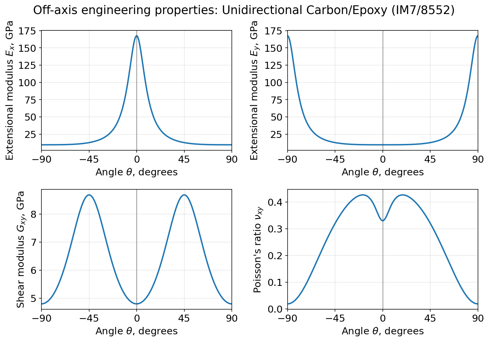
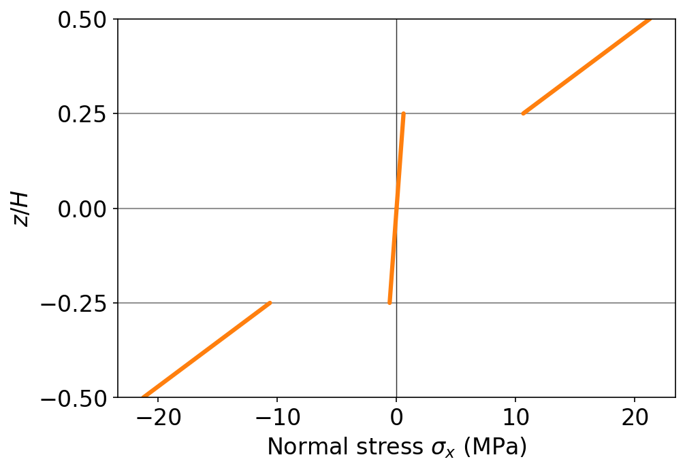
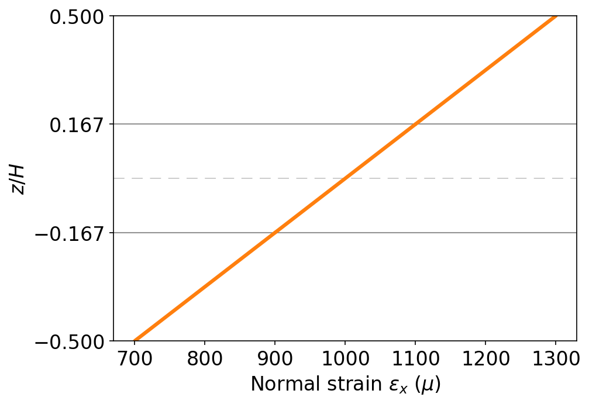
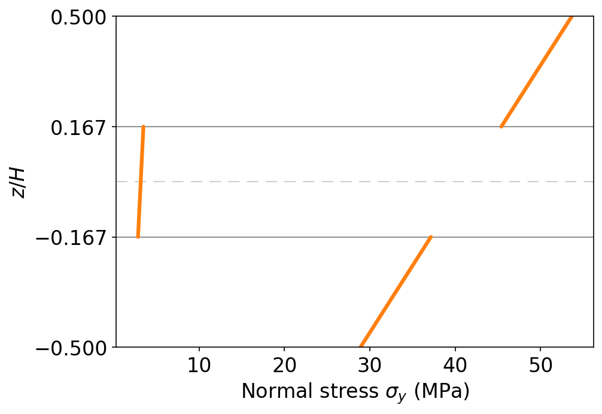
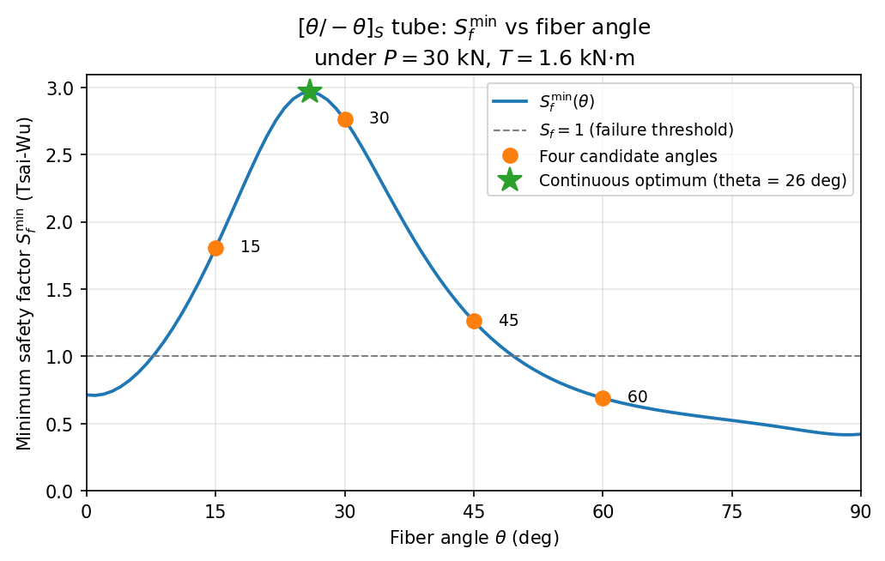
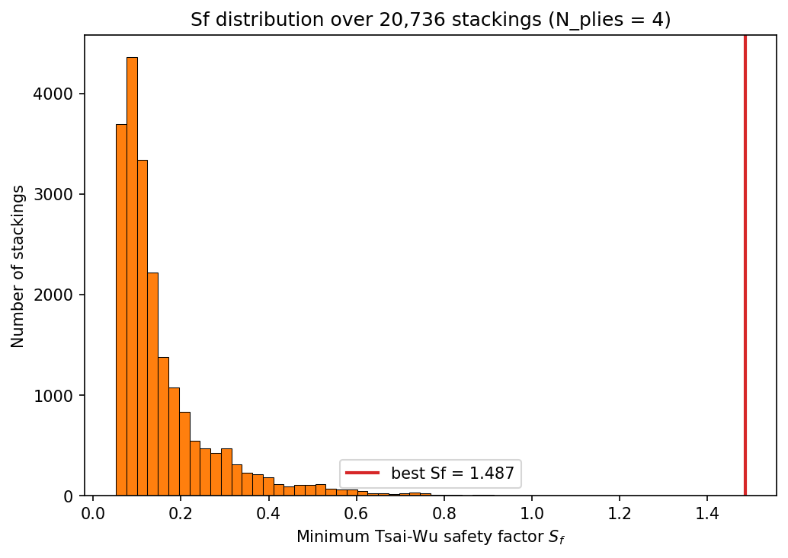
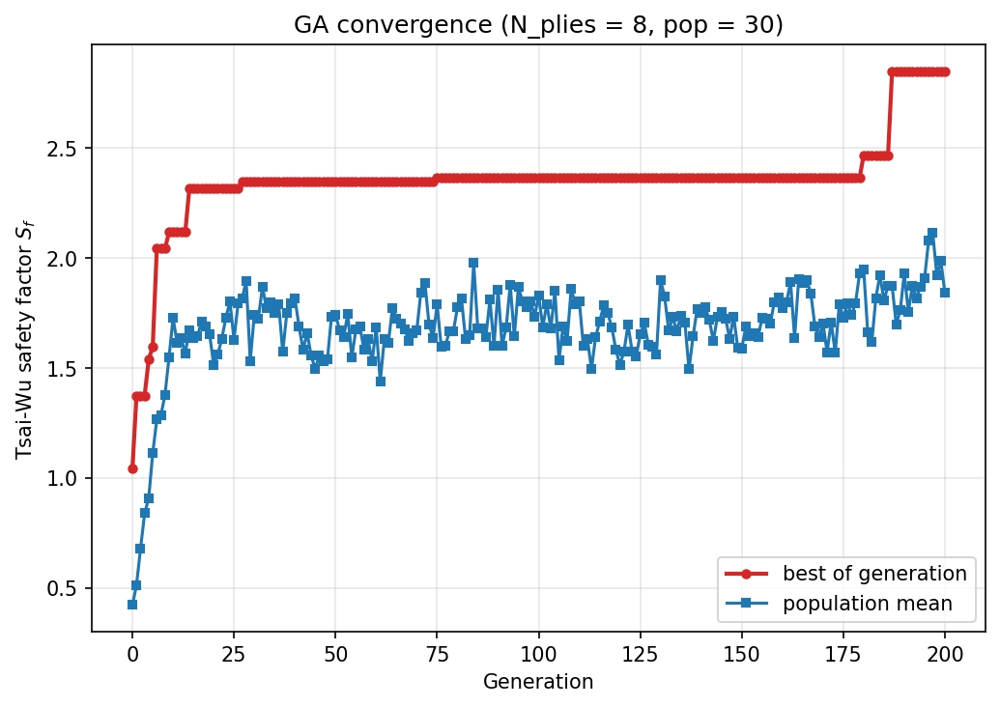
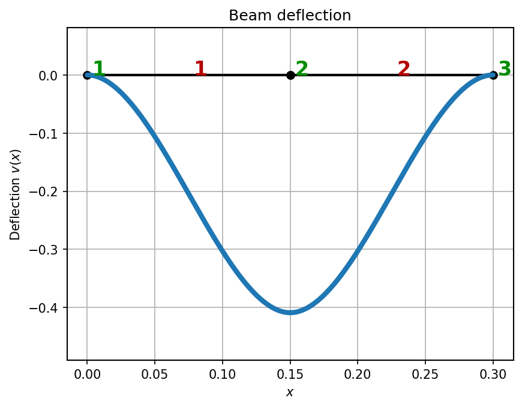

# Companion Python Toolkit — *Analysis of Laminated Composite Structures: Modeling, Simulation, and Optimization*

### Senthil S. Vel &nbsp;·&nbsp; Serge R. Maalouf

This repository is the Python companion to the textbook *Analysis of
Laminated Composite Structures: Modeling, Simulation, and Optimization*.
It is intended to be read alongside the text
so that a reader can move freely between a derivation in the chapter and the
matching code that reproduces every numerical value, table, and figure.

The package focuses on Part I of the book (lamina mechanics, classical
lamination theory, failure analysis, stacking-sequence optimisation, and a
first finite-element example). The full toolkit that ships with the complete
book also covers progressive-failure analysis, FSDT/Timoshenko beams, and
Kirchhoff and Mindlin plate FE.

> Each plot in this README is reproduced verbatim by running one short,
> self-contained Python script — nothing is hand-drawn or hand-tuned.

## Highlights

1. **Textbook ↔ code parallelism is exact.** Every worked example in the CLT
   chapter has a Python twin in `worked_examples/`. The numerical output and
   the figures in the book are the printed and plotted output of these
   scripts; nothing is hand-drawn or hand-tuned. Variable names mirror the
   notation used in the chapter ($\bar Q$, $A$, $B$, $D$, $\varepsilon^0$,
   $\kappa$, $S_f$).
2. **Code is written for graduate students, not for production.** One concept
   per function, one function per file, descriptive names, no clever
   abstractions. The reader can trace any printed number to a single
   short function.
3. **Three dependencies, one-command install.** The toolkit depends
   only on `numpy`, `matplotlib`, and `pyyaml`; install via
   `pip install -r requirements.txt` and run any script.
4. **Pedagogical toggles are first-class.** A failure-criterion switch
   (`"TsaiWu" | "MaxStress" | "Hashin"`) is exposed at the top of every
   laminate-level runner and threaded through the entire pipeline, so the
   student can re-run a worked example under a different criterion in one
   keystroke. The optimisation runner exposes its GA hyperparameters with
   inline literature ranges, turning the script into a controlled experiment
   the student can vary.

## Quick start

```bash
pip install -r requirements.txt   # numpy, matplotlib, pyyaml

python3 run_ply.py                                          # single-ply mechanics
python3 run_laminate.py                                     # ABD, through-thickness, FPF
python3 run_laminated_beam_fe_static.py                     # 2-DOF EB beam FE
python3 run_stacking_optimization_brute_force.py            # global optimum (small N)
python3 run_stacking_optimization_genetic_algorithm.py      # GA at N where brute force is hopeless

python3 worked_examples/CLT_Example_1.py                    # CLT chapter Example 3.1
python3 worked_examples/CLT_Example_2.py                    # CLT chapter Example 3.2
python3 worked_examples/CLT_Example_3.py                    # CLT chapter Example 3.3
```

Every runner saves its complete printed transcript to
`results/<runner_name>/output.md` and its figures alongside it as
`fig01.png`, `fig02.png`, … One folder per analysis; nothing is mixed.

## The main runners

Two runners sit at the centre of the package and are the entry points
most readers should start with. They exercise the `ply/` and `laminate/`
packages end-to-end on small, transparent inputs and print every
intermediate quantity (transformation matrices, $[A]$, $[B]$, $[D]$,
through-thickness strains, stresses, safety factors).

### `run_ply.py` — single-ply mechanics

A single IM7/8552 ply at $\theta = 30°$ and 0.2 mm thickness is built,
its full set of derived quantities is computed and printed
($\bar Q$, $\bar S$, transformation matrices $T_\sigma$ and
$T_\varepsilon$, off-axis engineering moduli), and a representative
applied stress is transformed between the laminate $(x, y)$ and material
$(1, 2)$ frames. The script closes with a Tsai–Wu safety-factor
evaluation at the applied stress state and a four-panel sweep of the
engineering moduli over $\theta \in [-90°, 90°]$:



The four panels make the off-axis transformation machinery tangible at a
glance: $E_x(\theta)$ and $E_y(\theta)$ peak when the fibres align with
the loading direction, $G_{xy}(\theta)$ peaks at $\pm 45°$, and
$\nu_{xy}(\theta)$ exhibits the classic non-monotonic behaviour with
values that can exceed the isotropic upper bound of 0.5 between
$0°$ and $\sim 30°$. The script is the simplest possible thing that
fully exercises the ply-level API; everything later in the package
builds on it.

### `run_laminate.py` — multi-ply laminate analysis

A four-ply $[0/90/90/0]$ cross-ply IM7/8552 laminate is built, its
$[A]$, $[B]$, $[D]$ and engineering moduli are reported, and it is
loaded with a small bending moment $M_x$. The runner solves the CLT
constitutive system for the mid-surface strains and curvatures, then
walks through the thickness reporting strain, stress in the laminate
and material frames, and the Tsai–Wu safety factor at every ply
interface and mid-ply.

The figure below shows $\sigma_x(z)$ for this laminate. Strain (not
shown) is linear and continuous through the thickness; stress is
**piecewise discontinuous**, with jumps at every interface where the
ply orientation changes. The outer $0°$ plies carry stresses an order
of magnitude larger than the inner $90°$ plies — the chapter explains
why, and this single plot makes it visible.



The runner also locates $S_f^{\min}$ and identifies the dominant failure
mode at the critical $z$. A single top-of-file toggle
(`failure_criterion = "TsaiWu"` | `"MaxStress"` | `"Hashin"`) re-runs
the entire through-thickness analysis under any of the three criteria
without further edits.

## A walk through the CLT chapter, in code

The three worked examples in the CLT chapter are self-contained Python
scripts under `worked_examples/`. They use only the public API of the
`ply/` and `laminate/` packages — exactly what the chapter teaches.

### Example 3.1 — Strain and stress through the thickness

A `[45/0/-45]` IM7/8552 laminate is driven by prescribed mid-surface
strain and curvature. The strain field is linear and continuous through
the thickness (a direct consequence of the Kirchhoff hypothesis), while
the stress field is **piecewise discontinuous**, with jumps at every ply
interface from the $\bar Q$ mismatch.

| Strain $\varepsilon_x$ vs $z$ (continuous, linear) | Stress $\sigma_y$ vs $z$ (discontinuous at interfaces) |
|:---:|:---:|
|  |  |

The chapter explains *why* the strain is continuous and the stress is
not; the script is a 100-line Python file that *demonstrates* it. The
two are intended to be read side by side.

### Example 3.3 — Stacking-sequence design of a thin-walled tube

A composite tube under combined axial load and torque is designed for
maximum first-ply Tsai–Wu safety factor. The figure below sweeps the
fibre angle $\theta$ in a $[\theta/-\theta]_S$ tube and locates the
continuous optimum at $\theta \approx 26°$ (green star). Four candidate
discrete angles are overlaid (orange dots); only $\theta = 15°$ and
$\theta = 30°$ are usable, and only $\theta = 30°$ comes within 10% of
the continuous optimum.



This single plot motivates the entire stacking-sequence-optimisation
chapter that follows: continuous design space → discrete design space
→ combinatorial search.

## Optimisation: brute force vs genetic algorithm, side by side

The optimisation chapter pairs two runners that solve the **same**
problem — maximise $\min S_f$ over a discrete angle set — at two
problem sizes. The pedagogical point is direct: brute force gives the
ground truth where it is feasible, and a small integer-coded GA matches
it at low $N$ and survives at high $N$.

### Brute force at $N = 4$ (20,736 stackings, ~3 s)

Every sequence on the angle set $\{0, 15, ..., 165\}°$ is evaluated;
the histogram below is the resulting distribution of $\min S_f$ values.
Almost all stackings are unsafe ($S_f < 1$); the global optimum is the
single red line at $S_f = 1.49$.



### Integer-coded GA at $N = 8$ ($4 \times 10^8$ stackings, < 1 s)

At $N = 8$ the design space contains $12^8 \approx 4.3 \times 10^8$
stackings — well past brute force. The GA evaluates 6,030 of them
(0.0014% of the design space) and converges in under a second. The
convergence curve below shows the best-of-generation safety factor (red)
climbing in clear discrete jumps as the population discovers better
basins, alongside the population-mean (blue):



The GA hyperparameters (`pop_size`, `crossover_rate`, `mutation_rate`,
`tournament_k`, `n_elite`, `seed`) are exposed at the top of the runner,
each annotated inline with its literature-typical range. A student can
flip a single value and immediately see the effect on the convergence
curve.

## A first finite-element example

`run_laminated_beam_fe_static.py` is the gentlest entry into the FE
chapters of the book: a symmetric `[45/0/0/45]` laminate, two
Euler–Bernoulli (CLT) beam elements, two DOFs per node ($v$, $\phi$),
cubic-Hermite shape functions, fixed–fixed boundary conditions, and a
concentrated mid-span load. The runner walks through the canonical FE
pattern — mesh → BCs → loads → assemble $[K]$ → solve $[K]\{D\} = \{F\}$
→ post-process — and then performs through-thickness CLT analysis at the
critical section to locate $S_f^{\min}$ and the dominant failure mode.



This is the same pattern, at the same level of detail, that the full
toolkit reuses for FSDT beams and for Kirchhoff and Mindlin plates in
the chapters not included here.

## Repository layout

```
python_toolkit_intro/
├── README.md                                       ← you are here
├── requirements.txt                                ← numpy, matplotlib, pyyaml
│
├── materials/                                      ← YAML material files (CFRP, GFRP, foam)
├── ply/                                            ← create_ply, three failure criteria, mode diagnostic, off-axis plots
├── laminate/                                       ← create_laminate, ABD, through-thickness analysis
├── optimization/                                   ← stacking-sequence optimisation: fast evaluator, brute force, GA
├── fe_beams_clt/                                   ← Euler–Bernoulli (CLT) beam FE package
├── common/                                         ← shared display + generic FE machinery (assemble, solve, …)
│
├── run_ply.py                                      ← single-ply analysis
├── run_laminate.py                                 ← multi-ply laminate analysis
├── run_laminated_beam_fe_static.py                 ← 2-DOF EB beam FE example
├── run_stacking_optimization_brute_force.py        ← stacking-sequence optimisation, brute force
├── run_stacking_optimization_genetic_algorithm.py  ← stacking-sequence optimisation, integer-coded GA
│
├── worked_examples/                                ← Python twins of the chapter's worked examples
│   ├── CLT_Example_1.py                            ←   strain and stress through a [45/0/-45] laminate
│   ├── CLT_Example_2.py                            ←   ABD-matrix construction and decoupling discussion
│   └── CLT_Example_3.py                            ←   tube design under combined axial + torsion
│
├── docs/                                           ← curated figures referenced from this README
└── results/                                        ← runner output (auto-generated): output.md + figXX.png per runner
```

## Project conventions

- **1-based labels** for nodes, elements, and DOFs everywhere a student
  reads or modifies an array. Runners use 1-padded numpy arrays so that
  `D[5]` accesses the 5th global DOF directly.
- **One concept per function, one function per file.** Each package holds
  one small, named file per concept. Grep for a function name and find
  its source immediately.
- **Variable names mirror the chapter notation.** `E1`, `nu12`, `G12`,
  `F1t`, `F1c`, …, `Q`, `QBar`, `A`, `B`, `D`, `eps0`, `kappa`, `Sf`.
- **Failure-criterion toggle** (`"TsaiWu"` | `"MaxStress"` | `"Hashin"`)
  is exposed at the top of every laminate-level runner and dispatched
  through `evaluate_strains_stresses_Sf`, `find_min_safety_factor`,
  `plot_through_thickness_variations`, and the optimisation evaluators.
  The plot axis labels track the choice.

## Materials shipped

- `unidirectional_carbon_epoxy` (IM7/8552 properties)
- `unidirectional_glass_epoxy`
- `fabric_carbon_epoxy`
- `fabric_glass_epoxy`
- `foam_core` (PMI foam, used in sandwich-panel runners in the full toolkit)

Material files live in `materials/` as YAML with a fixed schema; SI
units throughout. Adding a new material is a single new YAML file with
the same fields.

## Beyond this package

The full toolkit that accompanies the complete book additionally includes:

- progressive-failure analysis (load- and displacement-controlled coupon,
  moment- and curvature-controlled beam) with total-ply-discount
  cascade detection;
- FSDT / Timoshenko beam FE (static + vibration, including a sandwich
  panel demonstration);
- Kirchhoff / MZC plate FE (static + vibration);
- Mindlin / FSDT plate FE (static + vibration, with a clean
  shear-locking demonstration via the `shear_integration` toggle).

These modules follow the same conventions used here.

## License

Released under the MIT License — see [LICENSE](LICENSE).
